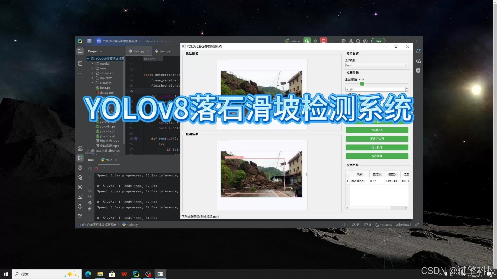
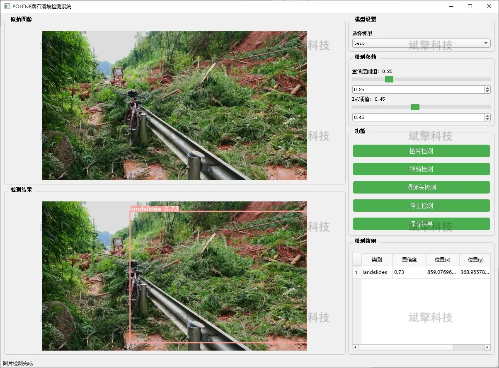
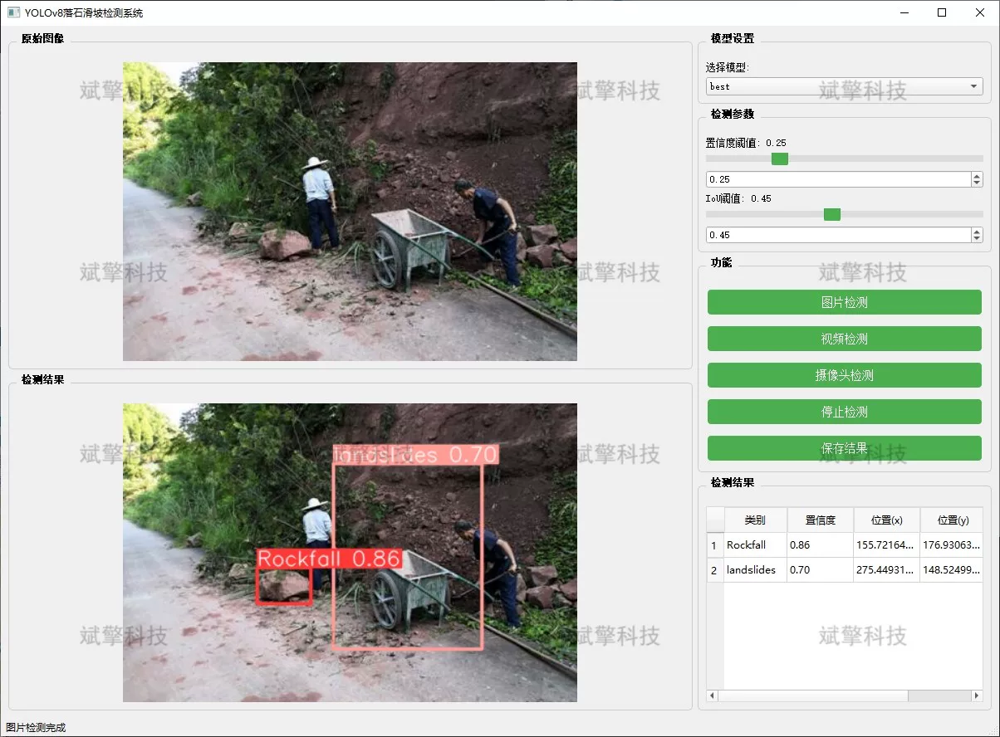
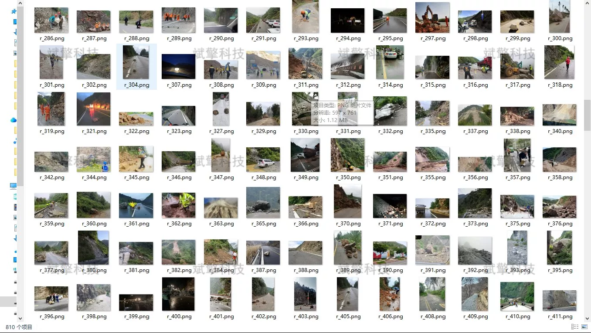

# YOLOv8 Slope and Rockfall Identification System

## Body

The YOLOv8 Landslide and Rockfall Identification System is based on the YOLOv8 deep learning for rockfall and landslide identification detection system (YOLOv8+YOLO dataset + UI interface + Python project source code + model).

This project has developed a rockfall and landslide detection system based on the YOLOv8 deep learning framework, aiming to solve the problems of low efficiency and low accuracy in traditional flower recognition methods.

The system adopts YOLOv8 as the core detection algorithm, which has the advantages of fast detection speed and high accuracy in the field of target detection, and is particularly suitable for real-time detection scenarios.

This project is based on the advanced YOLOv8 object detection algorithm, and has developed a set of intelligent slope rock detection system that integrates image detection, video detection and real-time camera detection.

The system can efficiently and accurately identify the two types of geological disaster targets, "rockfall" (falling rocks) and "landslides", providing an intelligent solution for early warning and rapid assessment of geological disasters.

Landslides and rockfall are the most common types of geological disasters, characterized by their suddenness and high destructive power.
Traditional monitoring methods are difficult to achieve real-time monitoring over a wide area at all times.

In recent years, the rapid development of deep learning technology has brought revolutionary breakthroughs to the field of object detection. Particularly, the YOLO series algorithms have provided technical possibilities for intelligent recognition of geological disasters with their excellent detection speed and precision.

System Function

✅ Image detection: Can detect images and return the detection box and category information.

✅ Video detection: Supports video file input, detecting the situation of each frame in the video.

✅ Real-time Camera Detection: Connect a USB camera to achieve real-time monitoring.

✅ Real-time parameter adjustment (confidence and IoU thresholds)

Dataset Overview

Training set: 810 images
Validation set: 90 images
Test set: 100 images

## Images

## Payment

Here is a pay link on Stripe ( https://buy.stripe.com/3cs8yP7sY87d0vu9AB ). Please contact me lonlonago@foxmail.com after funding $89, and I will send you a complete data files , thank you!

